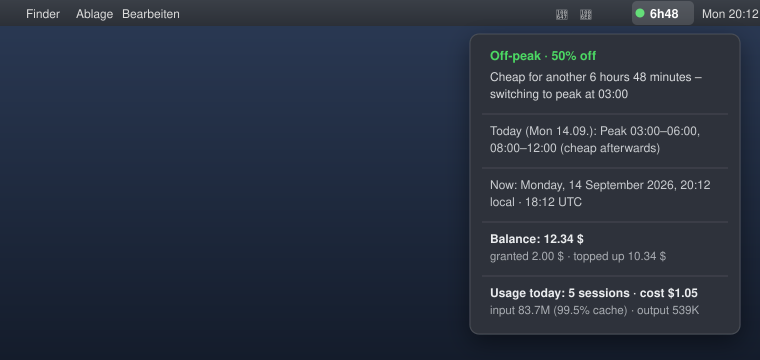

# DeepSeek Off-Peak Menubar

🌐 **English** · [Deutsch](README.de.md)

A tiny, dependency-free **macOS menu bar app** that shows whether DeepSeek API
pricing is currently in its cheap **off-peak** window – plus a countdown to the
next change, your account balance, and what your DeepSeek Harness (DSH) sessions
actually cost.

> **Unofficial.** This project is not affiliated with, endorsed by, or connected
> to DeepSeek. "DeepSeek" is used only to describe what the app works with.
> All prices are estimates based on DeepSeek's public pricing page.



## Features

- **Off-peak countdown in the menu bar** – `● 6h48` (green = off-peak,
  orange = peak). Deliberately written without a colon so it can never be
  mistaken for a clock time.
- **Correct pricing windows** – peak is Mon–Fri 01:00–04:00 and 06:00–10:00 UTC;
  everything else (including weekends) is off-peak. Timestamps are evaluated in
  UTC and verified by a built-in self test with 1,152 samples across the rule
  change of Aug 23, 2026.
- **Fully configurable** – windows, weekend rule, reminder lead times, cost
  settings and the UI language live in a JSON file that is reloaded live
  (no restart required).
- **Account balance** – queries the official
  [`GET /user/balance`](https://api-docs.deepseek.com/api/get-user-balance/)
  endpoint and warns when it drops below a configurable threshold.
- **Usage & cost tracking** – reads your local DSH session logs, splits input
  tokens into cache hits/misses, prices every request with the tariff that
  applied *at that moment*, and shows totals for today / 7 days / all time.
- **Reminders** – notifications shortly before a tariff change.
- **Localized** – English and German UI out of the box, easy to extend with
  plain `Localizable.strings` files.
- **No dependencies** – one Swift file, built with `swiftc`, universal binary
  (Intel + Apple Silicon).

## Requirements

- macOS 13 or newer
- Xcode Command Line Tools (`xcode-select --install`)
- Optional: [`zstd`](https://formulae.brew.sh/formula/zstd) (`brew install zstd`)
  for the usage/cost analytics. The app looks for it in `/usr/local/bin`,
  `/opt/homebrew/bin` and `/usr/bin`.

## Build & run

```bash
git clone https://github.com/pikasso-eu/deepseek-offpeak-menubar.git
cd deepseek-offpeak-menubar
./build.sh
open build/DeepSeekOffPeak.app
```

The app lives in the menu bar only (no Dock icon). To keep it around, copy it to
`/Applications` and enable **Start at login** from its menu.

## Menu

| Item | What it does |
|---|---|
| `● 6h48` | Time until the next tariff change (green = cheap, orange = peak) |
| Off-peak / peak status | Current tariff and when it ends |
| Today / tomorrow | Peak windows in your local time |
| Balance | Total, granted and topped-up balance, refreshes on demand |
| Usage | Sessions, input tokens (cache %), output tokens, cost in $/€ |
| Start DSH Web | Runs your `deepseek` alias (or `npx @deepseek-ai/dsh web`) in Terminal |
| Edit configuration | Opens `config.json` in TextEdit |

## Configuration

`~/Library/Application Support/DeepSeekOffPeak/config.json` – reloaded live.

```jsonc
{
  // Peak windows in UTC hours (start inclusive, end exclusive)
  "peakWindowsUtc": [ { "startHour": 1, "endHour": 4 }, { "startHour": 6, "endHour": 10 } ],
  "weekendsOffPeak": true,
  "weekendTimeZone": "Asia/Shanghai",    // weekends are determined in this zone

  "notifyOnChange": true,
  "remindersEnabled": true,
  "remindBeforeEndMinutes": [15, 5],
  "remindBeforeStartMinutes": [15, 5],

  "apiKey": "",                           // inline key (not recommended)
  "apiKeyEnv": "DEEPSEEK_API_KEY",        // environment variable name
  "apiKeyFile": "~/.config/deepseek.env", // or a KEY=VALUE file such as your .env
  "balanceBaseURL": "https://api.deepseek.com",
  "balanceRefreshMinutes": 15,
  "balanceWarnBelow": 2.0,
  "balanceWarnEnabled": true,
  "showBalanceInTitle": false,

  "usageRefreshMinutes": 5,               // DSH log scan interval
  "eurPerUsd": 0.91,                      // 0 disables the € estimate
  "language": "auto"                      // "auto" | "en" | "de"
}
```

Missing keys fall back to these defaults; invalid windows or thresholds are
filtered out. If the file cannot be parsed, the app reports it on stderr and
keeps the defaults.

### Balance API key

The key is only read locally and sent as a `Bearer` header to
`https://api.deepseek.com/user/balance`. It never leaves your machine otherwise.
Use `apiKeyFile` pointing at your existing `.env` if you launch the app from the
Finder, because Finder-launched apps do not inherit your shell environment.

## Command line

```bash
build/DeepSeekOffPeak.app/Contents/MacOS/DeepSeekOffPeak --text      # one status line
build/DeepSeekOffPeak.app/Contents/MacOS/DeepSeekOffPeak --balance   # account balance
build/DeepSeekOffPeak.app/Contents/MacOS/DeepSeekOffPeak --cost      # usage/cost of all DSH sessions
build/DeepSeekOffPeak.app/Contents/MacOS/DeepSeekOffPeak --selftest  # pricing-logic self test
build/DeepSeekOffPeak.app/Contents/MacOS/DeepSeekOffPeak --help
```

`--cost` example (English UI):

```
DSH usage (all workspaces) – billed per request (off-peak/peak):
• 14.09. 20:11  deepseek-cli   input 73.6M (hit 73.1M / miss 507K) · output 311K · 308 replies
    Cost: $0.83 · €0.75 · all off-peak: $0.83 · €0.75 · all peak: $1.66 · €1.51
Today: 5 sessions · 617 replies · input 83.7M (99.5% cache) · output 539K
   Cost (effective): $1.05 · €0.96
```

## Remote access (optional)

DSH deliberately binds to `127.0.0.1` only – exposing it to the network would
expose remote code execution. To use the web UI from a phone, forward the port
over SSH instead (e.g. ConnectBot/Termux on Android):

```bash
ssh -L 3080:127.0.0.1:3080 user@mac
```

Then open the token URL that `dsh web` prints, with the host replaced by
`127.0.0.1:3080`.

## Privacy

- Reads `~/.dsh/sessions/**/session*.jsonl.zstd` **locally** to compute usage.
- Reads the balance API key from the configured file or environment variable.
- No telemetry and no network traffic other than the balance request.

## Localization

English is the base language; German ships as a translation. To add a language,
copy `Resources/en.lproj/Localizable.strings`, translate the values, drop it in
`Resources/<code>.lproj/` and add the code to `CFBundleLocalizations` in
`Info.plist`. See [CONTRIBUTING.md](CONTRIBUTING.md).

## Disclaimer

DeepSeek may change pricing, model IDs or log formats at any time. This app
parses public pricing information and local logs – treat every number as an
estimate, not as a bill. Use at your own risk.

## More by me

This project is part of **[pikasso.eu.org](https://pikasso.eu.org)** – small,
focused tools by TheArk. Repositories live under
[github.com/pikasso-eu](https://github.com/pikasso-eu).

## License

[MIT](LICENSE) · © 2026 TheArk (pikasso.eu.org)
